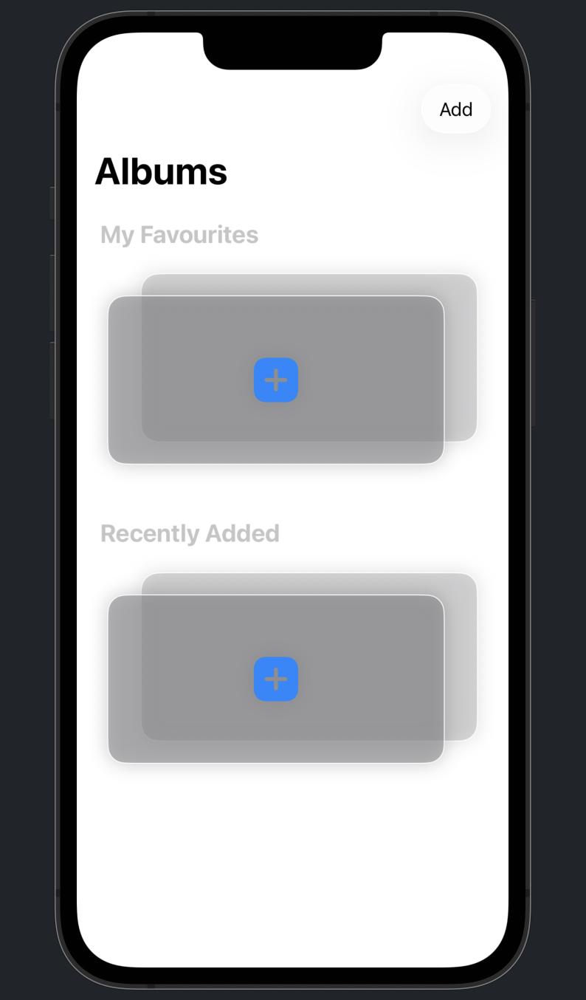
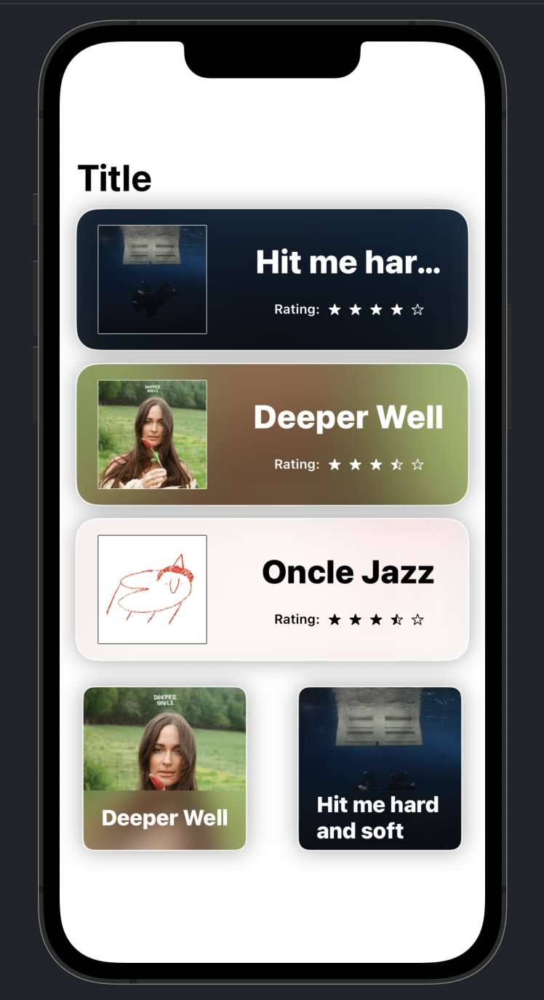
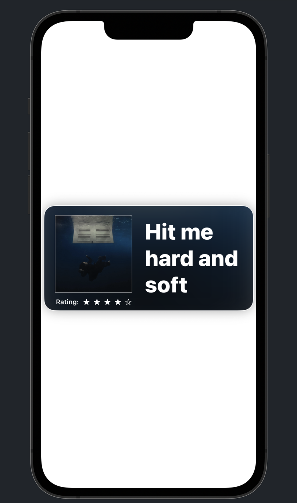
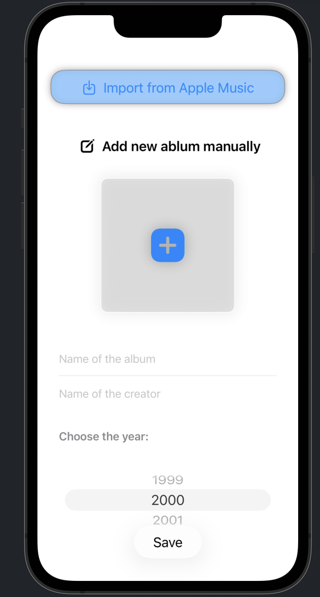

# AlbumShelf 🎵

> A native iOS app for tracking and rating your music album collection — built as a personal deep-dive into Swift and SwiftUI.

---

## Screenshots

| Home | Albums List | Album Card | Add Album |
|:----:|:-----------:|:----------:|:---------:|
|  |  |  |  |

---

## What it does

AlbumShelf lets you build a personal collection of music albums, rate them, and browse them in multiple layouts. It was built entirely as a self-directed learning project to develop hands-on iOS development skills outside of coursework.

**Core features:**

- **Import from Apple Music** — pull albums directly from your Apple Music library with one tap
- **Manual album entry** — add any album with a custom photo, name, creator, and release year via a wheel date picker
- **Star ratings** — rate each album out of 5 stars, stored persistently
- **Dynamic card colours** — album cards automatically derive their background colour from the album artwork, giving each card a unique visual identity
- **Dual layout** — browse your collection in a full list view (with artwork, name, and rating) or a compact grid view, both on the same screen
- **Sectioned home screen** — albums are organised into My Favourites and Recently Added sections with a stacked card visual style
- **Add button** — accessible from the top-right navigation bar on the home screen

---

## What I learned building this

This project was my first serious iOS app built from scratch. The main things I worked through:

- **SwiftUI layout system** — composing views, stacks, grids, and navigation hierarchies; understanding how SwiftUI's declarative model differs from imperative UI code
- **Auto Layout and adaptive sizing** — making cards and layouts respond correctly to different screen sizes and content lengths
- **Custom UI components** — building reusable card components with rounded corners, shadows, and dynamic backgrounds derived from image colours
- **Photo picker integration** — using `PhotosUI` to let users select album artwork from their photo library
- **Apple MusicKit** — integrating with the Apple Music API to fetch album metadata and artwork
- **Data persistence** — storing album ratings and collection data across app sessions
- **Navigation flows** — pushing and presenting views, passing data between screens
- **Xcode and the iOS simulator** — building, running, and debugging a real iOS project in the full Apple development toolchain

---

## Tech stack

| Tool | Purpose |
|------|---------|
| Swift | Primary language |
| SwiftUI | UI framework |
| PhotosUI | Album artwork photo picker |
| MusicKit / Apple Music API | Import albums from Apple Music |
| Xcode | IDE and iOS simulator |

---

## Project status

Work in progress — built as a learning exercise. The core collection, rating, and layout features are functional. Some rough edges remain (the list title shows a placeholder "Title" that hasn't been wired up yet, and a few views are still being polished).

---

## Author

**Ruian (Ryan) Ding**
[github.com/Ryan-c137](https://github.com/Ryan-c137)
